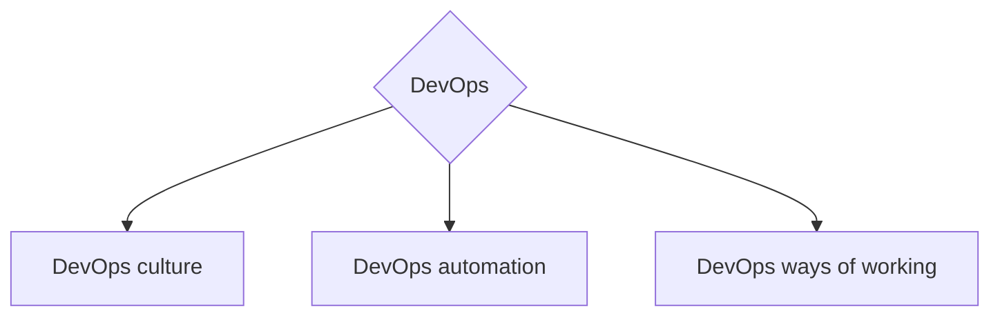

<h1 align="center">Привет, мир</a> 
</h1>
<h2 align="center">Всем, кому интересно развиваться в DevOps направлении, посвящается</h2>  

  

### Про мотивацию
В IT индустрии существует множество карт развития.  
Различные дорожныен карты базируются на различных направлениях, компетенциях и т.д.  
Данная работа сосредаточено именно на развитие инженеров, которые используют DevOps практики, а также для людей которые хотят развитиваться в этом DevOps направлении :)  
Данный проект сделан, для передачи опыта и создания единого видения развития компетенций в DevOps направлении в русскоязычном сообществе.

### О Работе
Предлагаемый путь развития не является:
- серебрянной пулей рещающей все проблемы
- истиной за которой нужно слепо следовать

### О методологической базе
Все рекомендации и путь развития построен на базе собственного опыта, а также опыта других инженеров.  
В качестве методологической базы используются [SFIA DevOps View](https://sfia-online.org/en/tools-and-resources/sfia-views/devops-skills-in-sfia) и [SFIA DevOps Skills](https://sfia-online.org/en/legacy-sfia/sfia-7/sfia-views/devops-view?path=/glance)

---
# DevOps Roadmap
## Основные ветви для развития в DevOps направлении

- DevOps culture - ветвь развития, посвящена совершенствованию компетенций и навыков связанных с построением культуры и влиянием на образ мышления людей в организации. Деятельность в этом направлении призвана устранить искусственные берьеры между функциями, отделами и командами. Провести переход к мышлению "ускоряющей" культуры DevOps, улучшать коммуникации, оптимизировать потоки информации в организации и обеспечить лучший процесс предоставления ценности клиенту.
- DevOps automation - ветвь развития, посвящена совершенствованию компетенций и навыков связанных с автоматизацией технических процессов и использованием различных технологий для автоматизации. Основной целью данного направления, является повышение скорости доставки и улучшение качества продукта, за счёт внедрения технических DevOps практик.
- DevOps ways of working - ветвь развития, посвящена совершенствованию компетенций и навыков связанных с созданием организационных процессов для поддержки культуры и продвижению способов работы с использованием DevOps практик. Все это зависит от вашей общей организационной структуры, но вам, вероятно, потребуется взглянуть на отделы, команды и роли, выходящие за рамки ваших основных команд разработки.