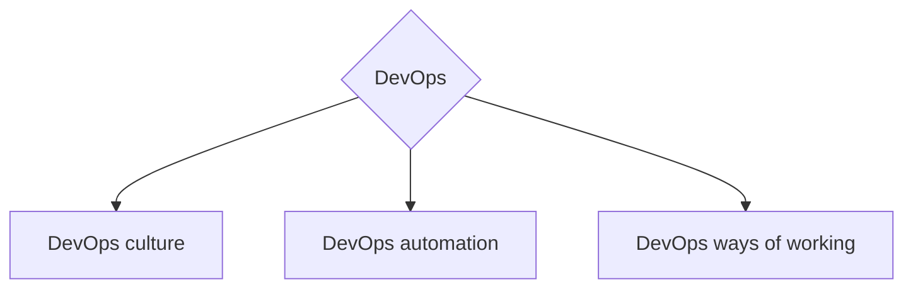

<h1 align="center">Привет, мир</a> 
</h1>
<h2 align="center">Всем, кому интересно развиваться в DevOps направлении, посвящается</h2>  

  

### Про мотивацию
В IT индустрии существует множество карт развития.  
Различные дорожныен карты базируются на различных направлениях, компетенциях и т.д.  
Данная работа сосредаточено именно на развития инженеров, которые используют DevOps практики, а также для людей которые хотят развитиваться в этом DevOps направлении :)  
Данный проект сделан, для передачи опыта и создания единого видения развития компетенций в DevOps направлении в русскоязычном сообществе.

### О Работе
Предлагаемый путь развития не является:
- серебрянной пулей рещающей все проблемы
- истиной за которой нужно слепо следовать
- фыв

### О методологической базе
Все рекомендации и путь развития построен на базе собственного опыта, а также опыта других инженеров.  
В качестве методологической базы используются [SFIA DevOps View](https://sfia-online.org/en/tools-and-resources/sfia-views/devops-skills-in-sfia) и [SFIA DevOps Skills](https://sfia-online.org/en/legacy-sfia/sfia-7/sfia-views/devops-view?path=/glance)

---
# DevOps Roadmap
