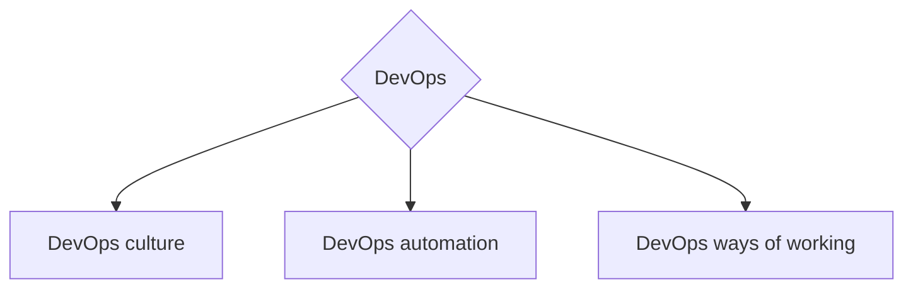
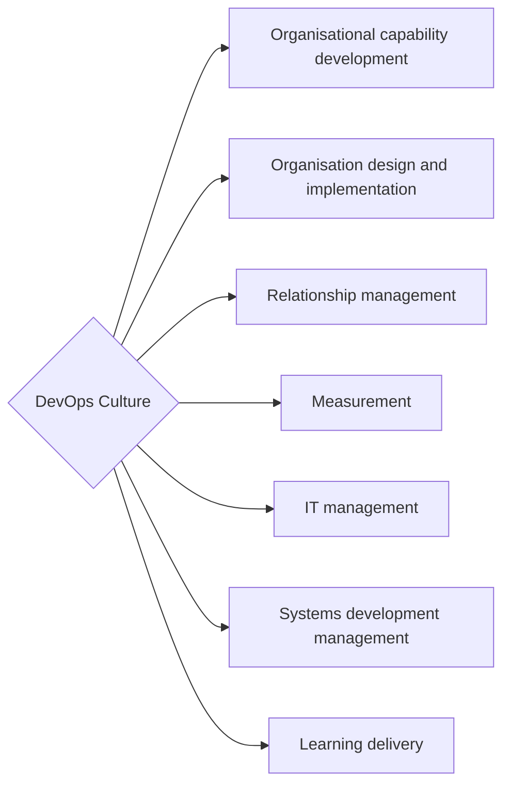
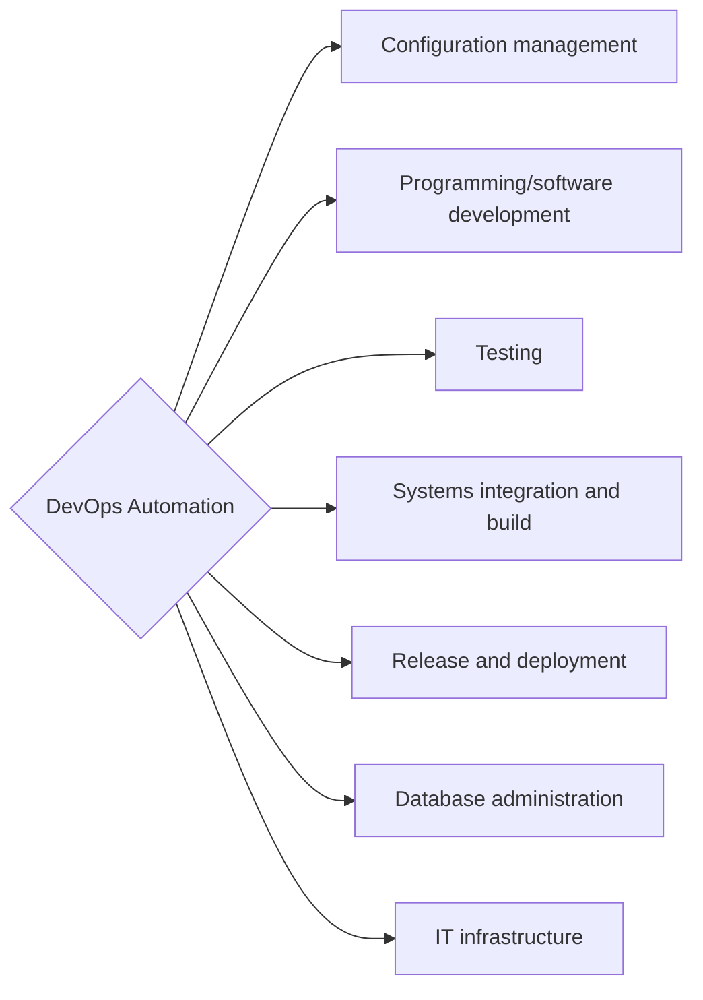
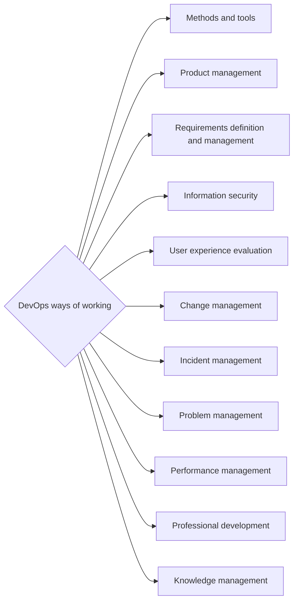
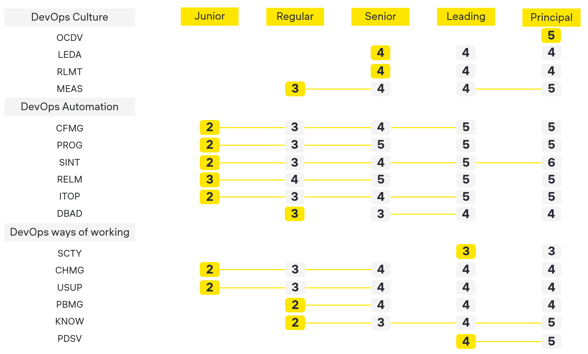

<h1 align="center">Привет, мир</a> 
</h1>
<h2 align="center"> Всем, кому интересно развиваться в DevOps направлении, посвящается! </h2>  

  

  
  

### Про мотивацию
В IT индустрии существует множество карт развития.  
Различные дорожные карты базируются на различных направлениях, компетенциях и т.д.  
Данная работа сосредоточена именно на развитии инженеров, которые используют DevOps практики, а также для людей, которые хотят развитиваться в этом DevOps направлении :)  
Данный проект сделан для передачи опыта и создания единого видения развития компетенций в DevOps направлении в русскоязычном сообществе.

### О работе
- DevOps MindMap - рассмотрим все возможные и рекомендованные к развитию ветви
- DevOps Roadmap - рассмотрим инкрементальное приращение экспертизы и предполагаемый путь развития

### Дисклеймер
Предлагаемый путь развития не является:
- серебряной пулей, решающей все проблемы
- истиной за которой нужно слепо следовать

### О методологической базе
Все рекомендации и путь развития построен на базе собственного опыта, а также опыта других инженеров.  
В качестве методологической базы используются [SFIA DevOps View](https://sfia-online.org/en/tools-and-resources/sfia-views/devops-skills-in-sfia) и [SFIA DevOps Skills](https://sfia-online.org/en/legacy-sfia/sfia-7/sfia-views/devops-view?path=/glance)

---
# The way of DevOps
## Основные ветви для развития в DevOps направлении

- DevOps culture - ветвь развития, посвящена совершенствованию компетенций и навыков, связанных с построением культуры и влиянием на образ мышления людей в организации. Деятельность в этом направлении призвана устранить искусственные барьеры между функциями, отделами и командами. Провести переход к мышлению "ускоряющей" культуры DevOps, улучшать коммуникации, оптимизировать потоки информации в организации и обеспечить лучший процесс предоставления ценности клиенту.  

- DevOps automation - ветвь развития, посвящена совершенствованию компетенций и навыков связанных с автоматизацией технических процессов и использованием различных технологий для автоматизации. Основной целью данного направления, является повышение скорости доставки и улучшение качества продукта, за счёт внедрения технических DevOps практик.  

- DevOps ways of working - ветвь развития, посвящена совершенствованию компетенций и навыков, связанных с созданием организационных процессов для поддержки культуры и продвижению способов работы с использованием DevOps практик. Все это зависит от вашей общей организационной структуры, но вам, вероятно, потребуется взглянуть на отделы, команды и роли, выходящие за рамки ваших основных команд разработки, чтобы получить полную картину об организации.
---
## DevOps culture
Компетенции для развития в ветке `DevOps Culture`:

- Organisational capability development - деятельность, направленная на предоставление руководства, рекомендаций и поддержки внедрения изменений для оценки организационных возможностей, и определения, приоритизации и внедрения улучшений. Выбор, принятие и интеграция соответствующих отраслевых структур и моделей для руководства улучшениями. Систематическое использование оценок зрелости возможностей, показателей, определения процессов, управления процессами, повторяемости и внедрение соответствующих методов, инструментов и улучшенных навыков.  

- Organisation design and implementation - деятельность навыка включает в себя планирование, проектирование и внедрение интегрированной организационной структуры и культуры, включая расположение, ролевые профили, показатели производительности, компетенции и навыки. Фасилитация изменений, необходимых для адаптации к изменениям в технологиях, обществе, новых операционных моделях и бизнес-процессах. Поиск ключевых решения для создания требуемой культуры и способов их реализации и усиления для повышения эффективности организации.  

- Relationship management - деятельность, связанная с систематической идентификацией, анализом, управлением, отслеживанием и улучшением взаимоотношений с заинтересованными сторонами с целью достижения и улучшения взаимовыгодных результатов. Разработка подхода к управлению взаимоотношениями, который будет использоваться в организации, включая роли и обязанности, управление, политики, процессы и инструменты, а также механизмы поддержки. Использование формальных и неформальных каналов общения для достижения желаемого результата.  

- Measurement - деятельность, направленная на разработку и использование средств измерения для поддержки согласованных информационных потребностей организации. Планирование, реализация и контроль действий для измерения показателей процессов, продуктов и услуг с целью оценки производительности, прогресса и предоставления указаний и понимания фактических или потенциальных проблем, вопросов и рисков. Определение требований, выбор мер и шкал измерения, разработка методов сбора и анализа данных, установка целевых значений и пороговых значений. Измерение может применяться к организациям, проектам, процессам и рабочим продуктам.  

- IT management - деятельность, связанная с управлением ИТ-инфраструктурой и ресурсами, необходимыми для планирования, разработки, предоставления и поддержки ИТ-услуг и продуктов для удовлетворения бизнес-потребностей. Управление процессом изменений и поддержанием нормативных, правовых и профессиональных стандартов. Управление производительностью систем и услуг с точки зрения их вклада в эффективность бизнеса, а также их финансовых затрат и устойчивости. Управление приобретенными услугами. Разработка планов постоянного улучшения услуг для обеспечения поддержки бизнес-потребностей с помощью ИТ-инфраструктуры.  

- Systems development management - деятельность, связанная с планированием, оценкой и выполнением программ разработки систем в соответствии со сроками, бюджетом и качеством. Определение ресурсов, необходимых для разработки систем, и того, как они будут эффективно обеспечены. Согласование деятельности по разработке систем и результатов с согласованными архитектурами и стандартами. Разработка дорожных карт для построения планов разработки систем. Принятие и адаптация моделей жизненного цикла разработки систем на основе контекста работы и соответствующего выбора из прогнозирующих (плановых) подходов или адаптивных (итерационных/гибких) подходов.  

- Learning delivery - деятельность направленная на передачу бизнес и/или технических навыков и знаний и продвижение профессиональных качеств с целью облегчения обучения и развития. Использование ряда методов, ресурсов и медиа (которые могут включать онлайн обучение, виртуальные среды в режиме онлайн, самооценку, партнерские программы, симуляции и другие современные методы).

---
## DevOps Automation
Компетенции для развития в ветке `DevOps Automation`:

- Configuration management - деятельность, связанная с планированием, управлением, контролем и управлением активами и артефактами организации, проектами и услугами. Идентификация, классификация и спецификация конфигурационных единиц и их взаимосвязей. Выявление конфигурации и версии исходного кода, программного обеспечения, систем, документов и сервисных конфигурационных единиц в определенные моменты времени. Систематический контроль изменений конфигурации и поддержание целостности и возможности отследить изменения конфигурации на протяжении всего жизненного цикла проекта, системы и/или услуги. Выявление и документирование функциональных и физических характеристик конфигурационных единиц, управление изменениями характеристик конфигурационных единиц, запись и отчетность об обработке изменений и статусе утилизации. Проверка и аудит конфигурационных единиц на предмет качества данных и соответствия заданным внутренним и внешним требованиям.  

- Programming/software development - деятельность, связанная с планированием, проектированием, созданием, изменением, проверкой, тестированием и документированием новых и измененных компонентов программного обеспечения с целью предоставления ценности заинтересованным сторонам. Выявление, создание и применение согласованных стандартов и процессов разработки программного обеспечения и безопасности. Принятие и адаптация моделей жизненного цикла разработки программного обеспечения на основе контекста работы и соответствующий выбор из прогнозных (основанных на планах) подходов или адаптивных (итерационных/гибких) подходов.  

- Testing - деятельность, связанная с планированием, проектированием, управлением, выполнением и предоставлением отчетности по тестам с использованием соответствующих инструментов и методов тестирования и в соответствии с согласованными технологическими стандартами и отраслевыми правилами. Целью тестирования является обеспечение того, чтобы системы, конфигурации, пакеты или услуги, вместе с любыми интерфейсами, работали, как указано в спецификации (включая требования безопасности), и что риски, связанные с развертыванием, были адекватно поняты и задокументированы. Тестирование включает в себя процесс разработки, использования и сопровождения тестового ПО (тестовых примеров, тестовых сценариев, отчетов тестирования, планов тестирования и т. д.) для измерения и улучшения качества, тестируемого ПО.  

- Systems integration and build - деятельность, связанная с планированием, реализацией и контролем действий по интеграции/созданию компонентов, подсистем и интерфейсов для создания операционных систем, продуктов или услуг для доставки клиентам или для внутренних, или промежуточных целей, таких как тестирование. Развитие организации в области системной интеграции и сборки, включая автоматизацию и непрерывную интеграцию.  

- Release and deployment - деятельность, связанная с управлением процессами, системами и функциями для формирования пакетов, сборки, тестирования и развертывания изменений и обновлений (которые обозначены как «релизы») в промышленной среде, создание услуги, для обеспечения контролируемой и эффективной передачи в оперативное управление и использование пользователями. Применение автоматизации для повышения эффективности и качества релизов.  

- Database administration - деятельность, связанная с установкой, настройкой, обновлением, администрированием, мониторингом и обслуживанием баз данных. Обеспечение поддержки баз данных в различных средах, использованием бах данных для итерационной и иной другой разработки и тестирования. Повышение производительности баз данных, использование инструментов и процессов для администрирования баз данных (включая автоматизацию).  

- IT infrastructure - деятельность, связанная с эксплуатацией и контролем ИТ-инфраструктуры (включая физическое или виртуальное оборудование, программное обеспечение, сетевые сервисы и хранилище данных) либо локально, либо в виде облачных сервисов, которым необходимо предоставление поддержки информационных систем, необходимых для бизнеса. Включает в себя сопровождение ИТ услуг, выполнение процесса изменений, поддержание нормативных, юридических и профессиональных стандартов, создание и управление системами и компонентами в виртуализированных и облачных вычислительных средах, а также мониторинг производительности систем и услуг в отношении их вклада в эффективность бизнеса, безопасности и устойчивости. Применение инструментов управления инфраструктурой для автоматизации подготовки, тестирования, развертывания и мониторинга компонентов инфраструктуры.  

---
## DevOps ways of working
Компетенции для развития в ветке `DevOps ways of working`:

- Methods and tools - деятельность, связанная с определением, адаптацией, внедрением, оценкой, измерением, автоматизацией и улучшением методов и инструментов для поддержки планирования, разработки, тестирования, эксплуатации, управления и обслуживания систем. Обеспечение принятия и эффективного использования методов и инструментов во всей организации.  

- Product management - деятельность, связанная с управлением продуктами или услугами на протяжении всего их жизненного цикла (от начала до вывода из эксплуатации) с целью удовлетворения рыночных возможностей и потребностей клиентов/пользователей и создания максимально возможной ценности для бизнеса. Принятие и адаптация моделей разработки продукта на основе контекста работы и соответствующий выбор из прогнозных (плановых) подходов или адаптивных (итерационных/гибких) подходов.  

- Requirements definition and management - деятельность, направленная на выявление, анализ, спецификацию и проверку требований и ограничений на уровне, который позволяет эффективно разрабатывать и эксплуатировать программное обеспечение, системы, процессы, продукты и услуги. Управление требованиями на протяжении всего цикла поставки и эксплуатации программного обеспечения, системы, процессов, продуктов или услуг. Переговоры о компромиссах, приемлемых как для основных заинтересованных сторон, так и в рамках бюджетных, технических, нормативных и других ограничений. Принятие и адаптация моделей управления требованиями в течение жизненного цикла на основе контекста работы и выбор надлежащих подходов, основанных на планах/прогнозах, или более адаптивных (итеративных и гибких) подходов.  

- Information security - деятельность включает в себя: выбор, проектирование, обоснование, внедрение и реализацию стратегий контроля и управления в целях поддержания безопасности, конфиденциальности, целостности, доступности, подотчетности и надлежащего соответствия информационных систем законодательству, нормативным положениям и соответствующим стандартам.  

- User experience evaluation - включает в себя такую деятельность как: валидация систем, продуктов или услуг, для гарантии, соблюдения требований заинтересованных сторон и организации того, чтобы требуемая практика была соблюдена, а используемые системы удовлетворяли потребности организации и пользователей. Итерационная оценка (от ранних прототипов до окончательной реализации в промышленной среде) эффективности, результативности, удовлетворенности пользователей, здоровья и безопасности, а также доступности для измерения или улучшения удобства использования новых или существующих процессов с целью достижения оптимальных уровней удобства использования продукта или услуги.  

- Change management - деятельность, связанная с управлением изменениями в сервисной инфраструктуре, включая сервисные активы, конфигурационные единицы и связанную документацию, также объектами изменений могут выступать изменения, связанные с инцидентами или проблемами, чтобы обеспечить эффективный контроль и снижение риска для доступности, производительности, безопасности и соответствия бизнес-сервисов, затронутых изменением.  

- Incident management - деятельность, направленная на обработку и координацию надлежащих и своевременных ответов на отчеты об инцидентах, включая направление запросов на помощь соответствующим функциям для решения, мониторинга действий по решению и информирования клиентов о прогрессе в восстановлении услуг.  

- Problem management - деятельность включает в себя, решение (как реактивное, так и проактивное) проблем на протяжении всего жизненного цикла информационной системы, включая классификацию, приоритизацию и инициирование действий, документирование основных причин и внедрение средств защиты для предотвращения будущих инцидентов.  

- Performance management - деятельность связанная с оптимизацией производительности персонала, включая определение способностей, интеграцию в команды, распределение задач, наставничество, поддержку, руководство, мотивацию и управление производительностью.  

- Professional development - деятельность, направленная на содействие профессиональному развитию людей, включая инициирование, контроль, анализ и согласование планов обучения и развития в соответствии с требованиями организации или бизнеса. Консультирование участников по всем аспектам их постоянного профессионального развития. Определение соответствующих ресурсов для обучения/развития. Обеспечение связи с внутренними и внешними провайдерами обучения. Проведение оценки выгод постоянного профессионального развития.  

- Knowledge management - деятельность, связанная с систематическим управлением жизненно важными знаниями для создания ценности для организации путем сбора, обмена, развития и использования коллективных знаний организации для производительности, поддержки принятия решений и снижения рисков. Развитие благоприятной и поощряющей коллаборацию культуры обмена знаниями для успешного внедрения технологических решений для управления знаниями. Обеспечение доступа к неформальным, неявным знаниям, а также формальным, задокументированным, явным знаниям путем фасилитации внутренней и внешней коллаборации и коммуникации.

---

## 
<h2 align="center"> Рекомендуемый Roadmap для преращения знаний </h2>  

  

