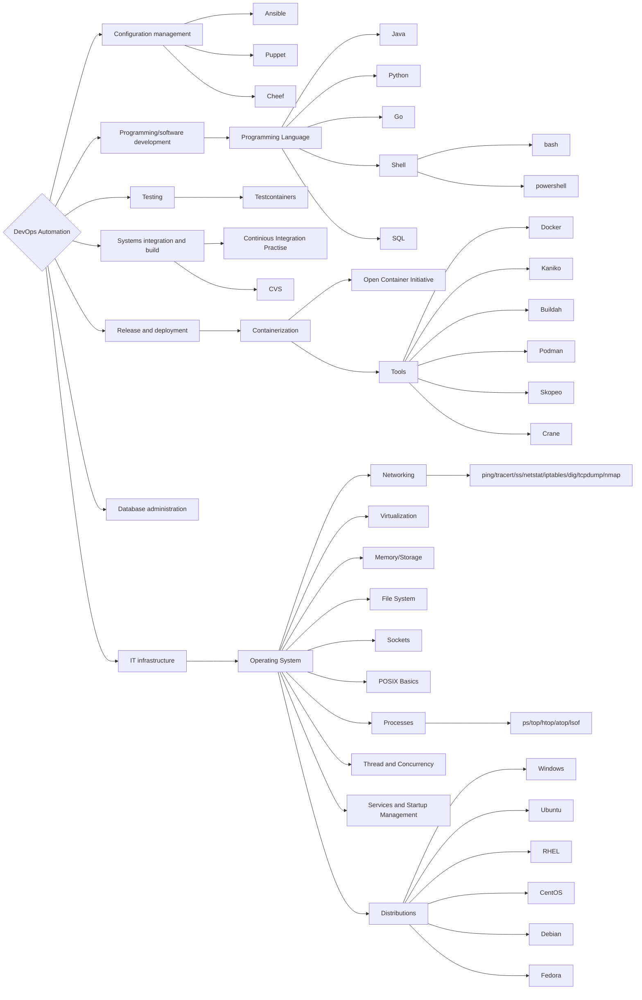

# DevOps Automation
Компетенции для развития в ветке `DevOps Automation`:

```mermaid
graph LR
    DevOpsAutomation{DevOps Automation}
    DevOpsAutomation --> CFMG[Configuration management]
    DevOpsAutomation --> PROG[Programming/software development]
    DevOpsAutomation --> TEST[Testing]
    DevOpsAutomation --> SINT[Systems integration and build]
    DevOpsAutomation --> RELM[Release and deployment]
    DevOpsAutomation --> DBAD[Database administration]
    DevOpsAutomation --> ITOP[IT infrastructure]

    CFMG --> Ansible
    CFMG --> Puppet
    CFMG --> Cheef

    PROG --> ProgrammingLanguages[Programming Language]
    ProgrammingLanguages --> Java
    ProgrammingLanguages --> Python
    ProgrammingLanguages --> Go
    ProgrammingLanguages --> Shell
    Shell --> bash
    Shell --> powershell
    ProgrammingLanguages --> SQL

    TEST --> TestContainers[Testcontainers]

    SINT --> CI[Continious Integration Practise]
    SINT --> CVS
    
    RELM --> Containerization
    Containerization --> OCI[Open Container Initiative]
    Containerization --> Tools
    Tools --> Docker
    Tools --> Kaniko
    Tools --> Buildah
    Tools --> Podman
    Tools --> Skopeo
    Tools --> Crane

    DBAD

    ITOP --> OS[Operating System]
    OS --> Networking
    Networking --> NetworkTools[ping/tracert/ss/netstat/iptables/dig/tcpdump/nmap]
    OS --> Virtualization
    OS --> MemoryStorage[Memory/Storage]
    OS --> FS[File System]
    OS --> Sockets
    OS --> POSIX[POSIX Basics]
    OS --> Processes
    Processes --> ProcessesTools[ps/top/htop/atop/lsof]
    OS --> ThreadAndConcurrency[Thread and Concurrency]
    OS --> ServicesAndStartupMgmt[Services and Startup Management]
    OS --> Distributions
    Distributions --> Windows
    Distributions --> Ubuntu
    Distributions --> RHEL
    Distributions --> CentOS
    Distributions --> Debian
    Distributions --> Fedora


```