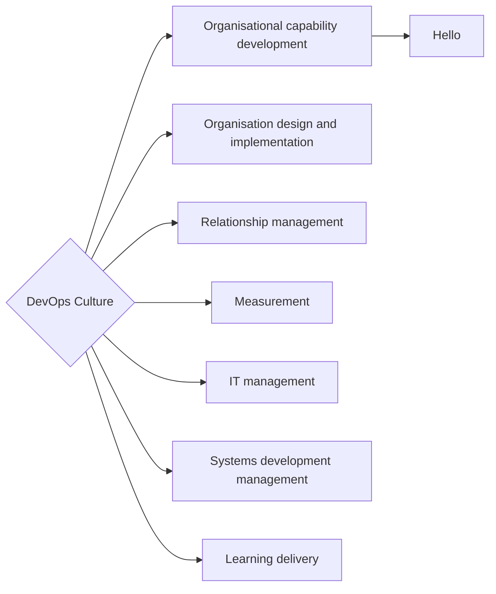

# DevOps Culture
Компетенции для развития в ветке `DevOps Culture`:

```mermaid
graph LR
    DevOpsCulture{DevOps Culture}
    DevOpsCulture --> OCDV[Organisational capability development]
    DevOpsCulture --> ORDI[Organisation design and implementation]
    DevOpsCulture --> RLMT[Relationship management]
    DevOpsCulture --> MEAS[Measurement]
    DevOpsCulture --> ITMG[IT management]
    DevOpsCulture --> DLMG[Systems development management]
    DevOpsCulture --> ETDL[Learning delivery]

    OCDV --> Ways[Hello]
```