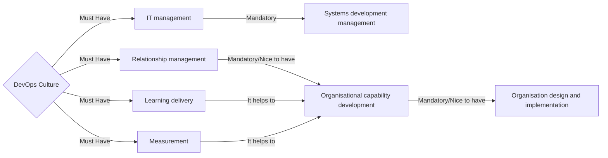
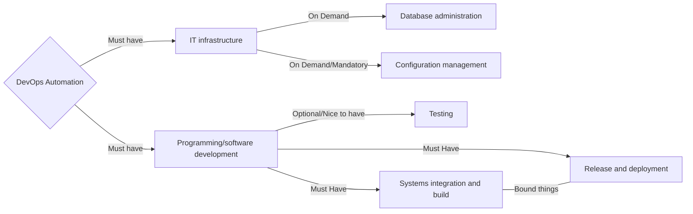
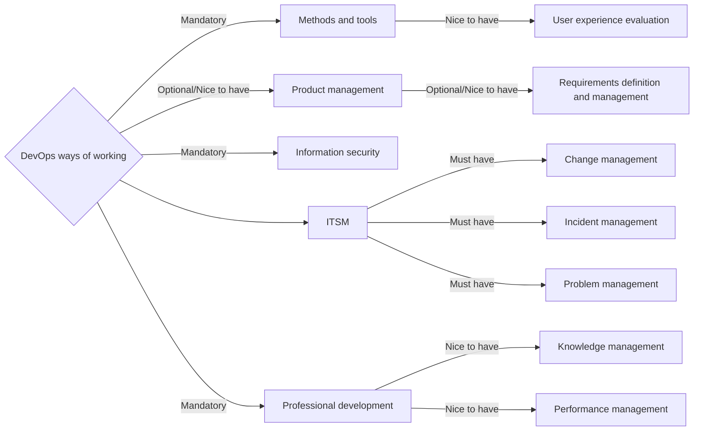

# DevOps Roadmap
Предполагаемая последовательность совершенствования компетенций с приоритетами.  

## DevOps Culture

```mermaid
graph LR
    DevOpsCulture{DevOps Culture}
    DevOpsCulture-- Must Have --> ITMG[IT management]
    ITMG-- Mandatory --> DLMG[Systems development management]

    DevOpsCulture-- Must Have --> ETDL[Learning delivery]
    DevOpsCulture-- Must Have --> RLMT[Relationship management]

    RLMT-- Mandatory/Nice to have --> OCDV[Organisational capability development]
    OCDV-- Mandatory/Nice to have --> ORDI[Organisation design and implementation]
    DevOpsCulture-- Must Have --> MEAS[Measurement]
    ETDL-- It helps to -->OCDV
    MEAS-- It helps to -->OCDV
    
```

## DevOps Automation

```mermaid
graph LR
    DevOpsAutomation{DevOps Automation}
    DevOpsAutomation-- Must have --> ITOP[IT infrastructure]
    DevOpsAutomation-- Must have --> PROG[Programming/software development]

    ITOP-- On Demand --> DBAD[Database administration]
    ITOP-- On Demand/Mandatory --> CFMG[Configuration management]

    PROG-- Optional/Nice to have --> TEST[Testing]
    PROG-- Must Have --> SINT[Systems integration and build]
    PROG-- Must Have --> RELM[Release and deployment]
    SINT-- Bound things ---RELM
```

## DevOps ways of working

```mermaid
graph LR
    DevOpsWaysOfWorking{DevOps ways of working}

    DevOpsWaysOfWorking-- Mandatory --> METL[Methods and tools]
    METL-- Nice to have --> USEV[User experience evaluation]
    DevOpsWaysOfWorking-- Optional/Nice to have --> PROD[Product management]
    PROD-- Optional/Nice to have --> REQM[Requirements definition and management]

    DevOpsWaysOfWorking-- Mandatory --> SCTY[Information security]

    DevOpsWaysOfWorking --> ITSM
    ITSM-- Must have --> CHMG[Change management]
    ITSM-- Must have --> USUP[Incident management]
    ITSM-- Must have --> PBMG[Problem management]

    DevOpsWaysOfWorking-- Mandatory --> PDSV[Professional development]
    PDSV-- Nice to have --> KNOW[Knowledge management]
    PDSV-- Nice to have --> PEMT[Performance management]
```