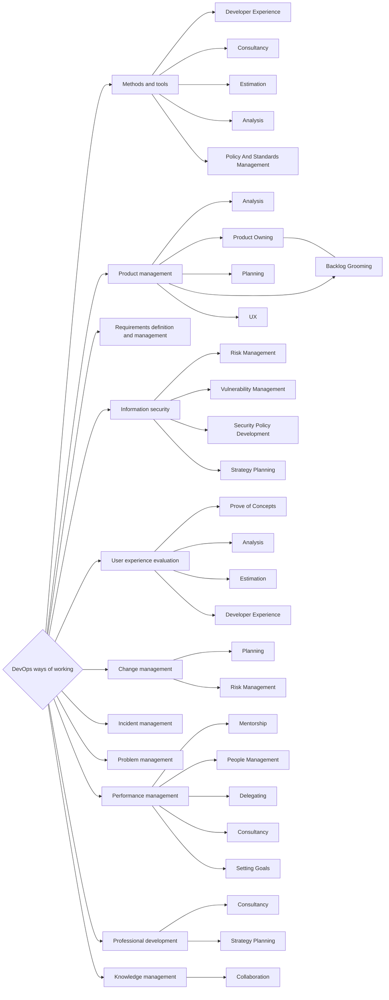

# DevOps ways of working
Компетенции для развития в ветке `DevOps ways of working`:

```mermaid
graph LR
    DevOpsWaysOfWorking{DevOps ways of working}
    DevOpsWaysOfWorking --> METL[Methods and tools]
    DevOpsWaysOfWorking --> PROD[Product management]
    DevOpsWaysOfWorking --> REQM[Requirements definition and management]
    DevOpsWaysOfWorking --> SCTY[Information security]
    DevOpsWaysOfWorking --> USEV[User experience evaluation]
    DevOpsWaysOfWorking --> CHMG[Change management]
    DevOpsWaysOfWorking --> USUP[Incident management]
    DevOpsWaysOfWorking --> PBMG[Problem management]
    DevOpsWaysOfWorking --> PEMT[Performance management]
    DevOpsWaysOfWorking --> PDSV[Professional development]
    DevOpsWaysOfWorking --> KNOW[Knowledge management]

    METL --> DevExp[Developer Experience]
    METL --> Consultancy
    METL --> Estimation
    METL --> Analysis
    METL --> PolicyAndStandardsManagement[Policy And Standards Management]

    PROD --> Analysis1[Analysis]
    PROD --> ProdOwn[Product Owning]
    PROD --> Planning
    PROD --> BacklogGrooming[Backlog Grooming]
    ProdOwn --- BacklogGrooming
    PROD --> UX
    
    SCTY --> RiskManagement[Risk Management]
    SCTY --> VulnerabilityManagement[Vulnerability Management]
    SCTY --> SecPolicyDev[Security Policy Development]
    SCTY --> StrategyPlanning[Strategy Planning]

    USEV --> PoC[Prove of Concepts]
    USEV --> Analysis2[Analysis]
    USEV --> Estimation1[Estimation]
    USEV --> DevExp1[Developer Experience]

    CHMG --> Planning1[Planning]
    CHMG --> RiskManagement1[Risk Management]

    PEMT --> Mentorship
    PEMT --> PeopleMgmt[People Management]
    PEMT --> Delegating
    PEMT --> Consultancy1[Consultancy]
    PEMT --> SettingGoals[Setting Goals]

    PDSV --> Consultancy2[Consultancy]
    PDSV --> StrategyPlanning1[Strategy Planning]

    KNOW --> Collaboration
```